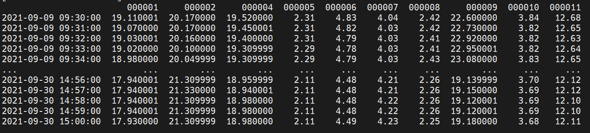
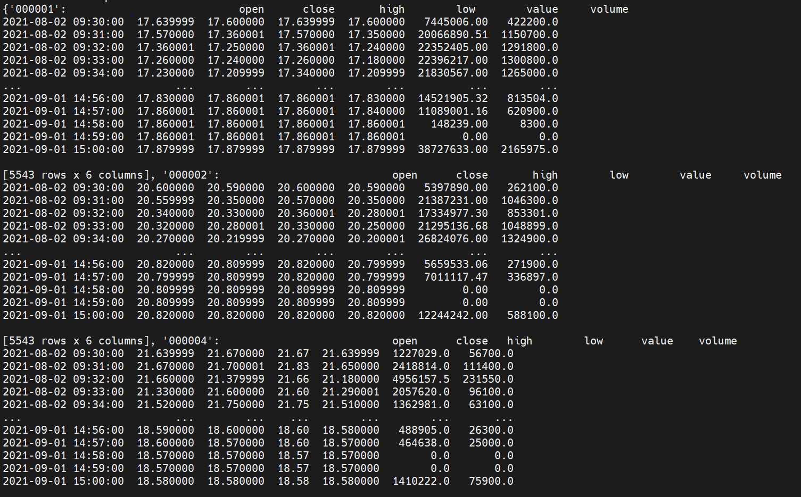
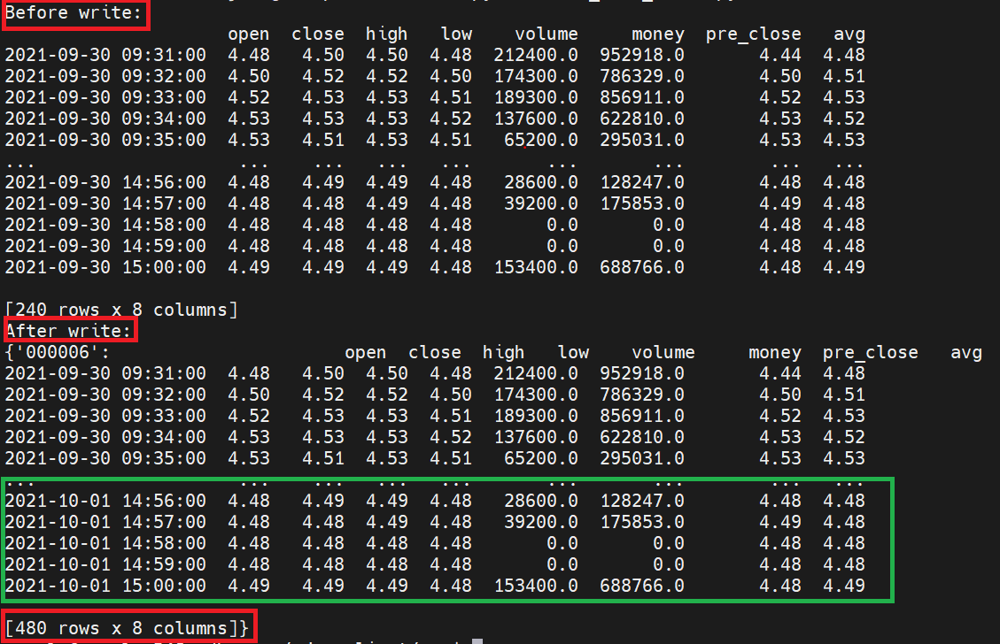
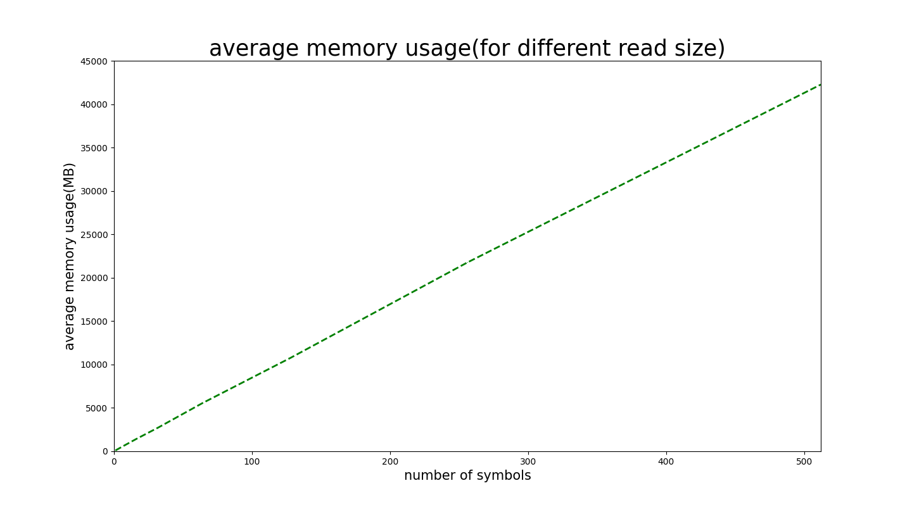
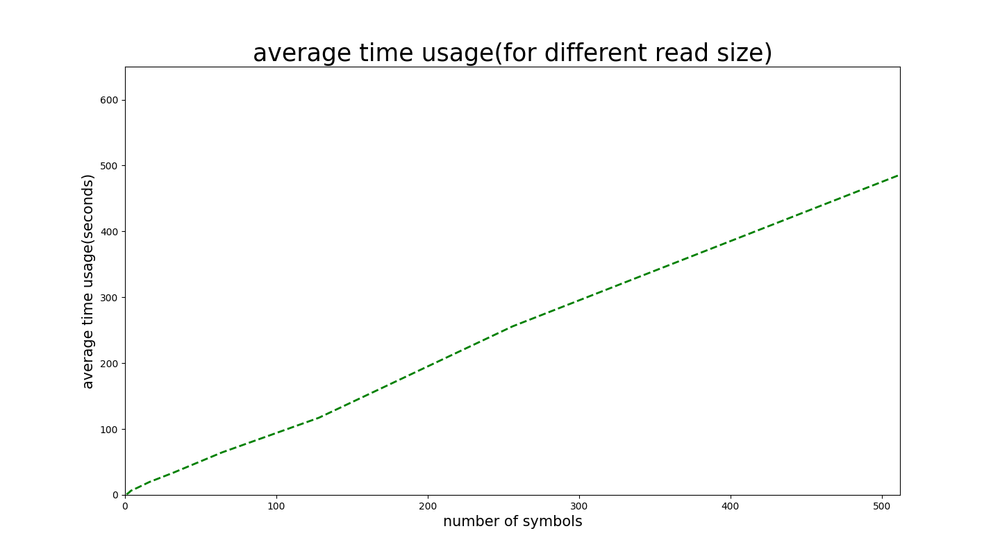

# h5文件读写库现在提供接口如下：
## 单行情读取接口  
   __get_data_with_one_column(datasource, start_date, end_date, symbols, column, level=4)__  
   > datasource: 数据源标志，e.g. "jk"(聚宽)  
   > start_date: 开始读取日期（如果用户填写的是非交易日，会顺延到下一个有效交易日）    
   > end_date: 结束读取日期（如果用户填写的是非交易日，会顺延到上一个有效交易日）  
   > symbols：股票列表  
   > column：单行情名称 e.g. "open"   
   > level: 并发等级：  
   >        1：全量并发，Poolsize为 内核总数  
   >        2: 半数并发，Poolsize为 内核总数/2  
   >        3: 三分并发，Poolsize为 内核总数/3  
   >        4: 最小并发，Poolsize为 内核总数/4  
   
   *返回一个dataframe，index是datetime形式的字符串，columns是股票列表*
   
   
## 全量行情读取接口  
   __get_data_with_all_columns(datasource, start_date, end_date, symbols, level=4)__
   > datasource: 数据源标志，e.g. "jk"(聚宽)  
   > start_date: 开始读取日期（如果用户填写的是非交易日，会顺延到下一个有效交易日）  
   > end_date: 结束读取日期（如果用户填写的是非交易日，会顺延到上一个有效交易日）  
   > symbols：股票列表 
   > level: 说明同单行情接口
 
   **注意**：
   1. 如果start_date > end_date, 接口会抛出相关日期错误; 
   2. start_date > 数据中的最迟有效交易日，对该股票而言，返回空DataFrame;  
   3. end_date < 数据中的最早有效交易日，对该股票而言，返回空DataFrame; 
   4. symbols列表中出现文件中没有的股票，对该股票而言，返回空DataFrame; 
   5. 用户查询的column不存在，结构抛出相关错误（针对单行情读取接口)
   
   *返回一个dict，key是股票列表，value是dataframe*
   
   
## 数据写入接口
   __dump_data_to_file(datasource, frame_dict)__  
   > datasource: 数据源标志，e.g. "jk"(聚宽)  
   > frame_dict: 字典，key是股票代码，value是pandas.DataFrame的数据（indexes 是datatime字符串，columns是属性名）  

   __写入测试代码__
   ``` python
   symbol = "000006"

   data = get_data_with_all_columns("jq", "2021-09-30", "2021-09-30", [symbol])
   frame = data[symbol]
   print("Before write: ")
   print(frame)

   #set the new index
   new_index = [datetime_string_delta(x, 1) for x in frame.index]
   frame.index = new_index

   #add 'time' and 'date' column
   frame['time'] = [0.0] * market_data_infos["jq"][1] * 1
   frame['date'] = [0.0] * market_data_infos["jq"][1] * 1

   new_dict = {}
   new_dict[symbol] = frame

   dump_data_to_file("jq", new_dict)

   data_new = get_data_with_all_columns("jq", "2021-09-30", "2021-10-10", [symbol])
   print("After write: ")
   print(data_new)
   ```
   __运行结果样例__:  
   
   __其中绿色部分是新写入的数据__！

   __注意__：
   1. 写入之前，接口会对用户写入的每个dataframe做合法性校验，条件包括：  
		1.1 columns 名称和顺序和h5文件data数据集attributes相同；  
		1.2 每一天数据是完整的（比如240条，不然会破坏文件的索引规则）  
   2. 校验成功，以append方式追加到h5文件中（重叠部分不写入）；  
   3. 如果数据中有h5文件中不存在的股票，那么为这个股票建立新的group，并在这个group中写入data，index，index_all数据;

## 数据回滚接口：
   __roll_back_for_symbols(datasource, destdate, symbols = [])__
   > datasource: 数据源
   > destdate: 回滚日期
   > symbols: 回滚股票列表，默认为空（回滚所有股票的数据）

   将优矿000001股票的数据回滚到2021-10-19日
   ``` python
   h5write.roll_back_for_symbols("yk", "2021-10-19", ["000001",])
   print("roll back finished!")
   ```

# 软件包编译，安装和使用

# 安装和使用说明
## 项目打包
   安装python构建工具:  
   ``` s
   python -m pip install --upgrade build
   ```

   在pyproject.toml同目录下执行命令：  
   ``` s
   pip -m install
   ```

   上述命令会在dist下生成两个包文件，用户何以任选一个使用。
## 安装
   用户将dist目录下的tar包或wheel上传对应机器，并执行：  
   ``` s
   pip install --force-reinstall rdsp-client-0.0.4.tar.gz
   ```
## 使用样例
   包安装成功之后，用户就可以使用软件包进行分钟数据的读写了：
   ``` python
   from FastH5 import h5read
   from FastH5 import h5write

   #读取优矿行情数据集中 000001 股票 open 字段的行情
   data1 = h5read.get_data_with_one_column("yk", "2001-01-01", "2021-10-10", ["000001", ], "open")
   print(data1)
   
   #读取优矿行情数据集中 000001 股票 全量行情数据
   data2 = h5read.get_data_with_all_columns("yk", "2001-01-01", "2021-10-10", ["000001", "000002"])
   print(data2)

   #原来数据
   data = h5read.get_data_with_all_columns("jq", "2021-10-13", "2021-10-13", [symbol])
   frame = data[symbol]

   #改造日期索引
   new_index = [h5write.datetime_string_delta(x, 1) for x in frame.index]
   frame.index = new_index

   #add 'time' and 'date' column
   frame['date'] = [0.0] * configs.market_data_infos["jq"][1] * 1
   frame['time'] = [0.0] * configs.market_data_infos["jq"][1] * 1

   new_dict = {}
   new_dict[symbol_new] = frame

   #数据写入
   h5write.dump_data_to_file("jq", new_dict)
   print("dump finish!")
   ```
# 性能测试
## 1. 单symbol全量行情读取测试：
> 'data' 数据集合定位 耗时：0.12s  
> 'index_all' 数据集合定位 耗时：0.50s  
> 'index_all' 数据集合转换 耗时：0.17s  
> dataframe 构建 耗时：0.04  

满足用户提出的单支股票全量行情读取时间 < 0.9s 的要求。

## 2. 串行并行加载临界点寻找：
当同时加载三支以上symbol的全量行情时，并行读取的性能好于串行读取；  
当同时加载三个以及三个以下symbol的全量行情时，串行读取的性能好于并行读取；  
设置串/并行临界阈值为3；  

## 3. 并发任务数和内存使用之间的关系：
   
   可见，任务数和内存使用情况呈现线性关系。

## 4. 并发任务数和总耗时之间的关系：
   

# 项目时间节点

| 时间 | 版本 | 主要内容|
| ------ | ------ | ------- |
| 2021/10/13 | v1.0 | 单行情读取接口，全行情读取接口初步完成；时间段处理部分待优化  |
| 2021/10/14 | v1.1 | 数据写入接口完成一半（对已有股票数据进行更新）|
| 2021/10/15 | v1.2 | 写入时数据校验，写入时文件加锁  |
| 2021/10/17 | v1.3 | 项目重构为python包模式，并增加并发级数功能  |
| 2021/10/18 | v1.4 | 设置并发/串行阈值；添加的关联包项 |"# hdf5_market_storage" 
